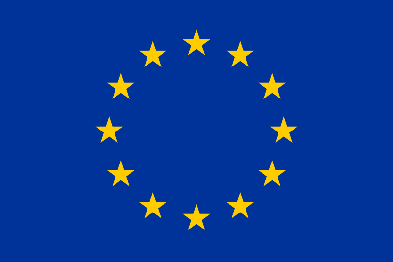

# EU-HERITAGE

**Підходи ЄС до містопланування та міської регенерації на основі культурної спадщини**
Модуль Жана Моне програми Erasmus+ у Київському національному університеті будівництва і архітектури (КНУБА)

🌐 Сайт проєкту: https://knuca-eu-heritage.github.io/eu-heritage/

[English version below](#english)

---

## Про проєкт

Післявоєнна відбудова України та статус кандидата на вступ до ЄС потребують містобудівників, які розуміють європейські підходи до врядування. Натомість у програмах їхньої підготовки мало уваги приділяють політикам ЄС. EU-HERITAGE заповнює цю прогалину: протягом 36 місяців модуль знайомить студентів, практиків і посадовців громад з європейськими рамками планування та регенерації історичних територій.

Особливу увагу приділено інклюзивному плануванню, тобто потребам жінок з дітьми, людей старшого віку, людей з інвалідністю та інших вразливих груп.

## Що пропонує проєкт

### Навчальний курс
Вибіркова дисципліна для студентів бакалаврату й магістратури спеціальності «Урбаністика та просторове планування»: 3 кредити ЄКТС, весняний семестр, українською мовою. Курс складається з трьох модулів:

1. Урбаністична політика ЄС: цінності, інклюзія та участь
2. Планування та регенерація на основі спадщини: досвід ЄС
3. Міська культурна спадщина: підходи ЄС до управління та регенерації

Завершується курс презентаціями студентських policy briefs. Записатися на нього можна в загальному порядку вибору дисциплін КНУБА.

### Відкриті вебінари та конференції
Протягом 2027–2029 років заплановано шість онлайн-вебінарів і три щорічні конференції (Київ, КНУБА, та онлайн). Участь безкоштовна. Актуальні дати, програми й форми реєстрації публікуються на сторінці [«Події»](https://knuca-eu-heritage.github.io/eu-heritage/uk/events/). Записи та матеріали минулих заходів також доступні там.

### Policy briefs
Студенти готують аналітичні записки, у яких застосовують рамки ЄС до конкретних українських міст і об'єктів. Найкращі роботи виходять у відкритій серії **Policy Brief Series**. Їх можна переглянути за темою, містом і роком.

### Ресурси
На сайті зібрано ключові документи ЄС і Ради Європи (Нова Лейпцизька хартія, Територіальний порядок денний 2030, Фарська конвенція, Новий європейський Баугауз тощо), а також навчальні матеріали проєкту.

## Команда

- Д-р Надія Гербут — координаторка модуля
- Алірза Мамедов — викладач, декан факультету урбаністики та просторового планування
- Д-р Любов Апостолова-Сосса — викладачка, кураторка комунікацій і подій

Детальніше — на сторінці [«Команда»](https://knuca-eu-heritage.github.io/eu-heritage/uk/about/team/).

## Контакти

Email: eu-heritage@knuba.edu.ua
Адреса: КНУБА, факультет урбаністики та просторового планування, просп. Повітряних Сил, 31, Київ, 03037, Україна

## Ліцензія

Матеріали проєкту доступні за ліцензією [CC BY 4.0](https://creativecommons.org/licenses/by/4.0/deed.uk), якщо не зазначено інше. Їх можна вільно використовувати й адаптувати з посиланням на джерело.

---

## English

**EU Approaches to Heritage-Based Urban Planning and Regeneration** is an Erasmus+ Jean Monnet Module (project No. 101322435) at Kyiv National University of Construction and Architecture (KNUBA), running for 36 months.

Ukraine's post-war reconstruction and EU candidate status call for urban planners who understand European governance frameworks. The Module brings EU approaches to planning and regenerating historic areas to students, practitioners and municipal officials, with a particular focus on inclusive planning.

**What the project offers:**

- **The course.** A 3 ECTS elective for Bachelor's and Master's students in urban and spatial planning, taught in Ukrainian in the spring semester.
- **Webinars and conferences.** Six online webinars and three annual conferences in 2027–2029, all free to attend. Dates, programmes and registration are on the [Events page](https://knuca-eu-heritage.github.io/eu-heritage/en/events/).
- **Policy Brief Series.** Open-access student briefs that apply EU frameworks to specific Ukrainian cases.
- **Resources.** Key EU and Council of Europe documents and the project's teaching materials.

**Website:** https://knuca-eu-heritage.github.io/eu-heritage/en/
**Contact:** eu-heritage@knuba.edu.ua
**Licence:** content is available under [CC BY 4.0](https://creativecommons.org/licenses/by/4.0/) unless otherwise stated.

---

 **Фінансується Європейським Союзом / Funded by the European Union**

Погляди та думки, висловлені тут, належать лише автору(-ам) і не обов'язково відображають погляди Європейського Союзу чи Європейського виконавчого агентства з питань освіти та культури (EACEA). Ні Європейський Союз, ні EACEA не несуть за них відповідальності.

Views and opinions expressed are however those of the author(s) only and do not necessarily reflect those of the European Union or the European Education and Culture Executive Agency (EACEA). Neither the European Union nor the granting authority can be held responsible for them.

Технічна інструкція зі встановлення та редагування сайту: [install.md](install.md).
